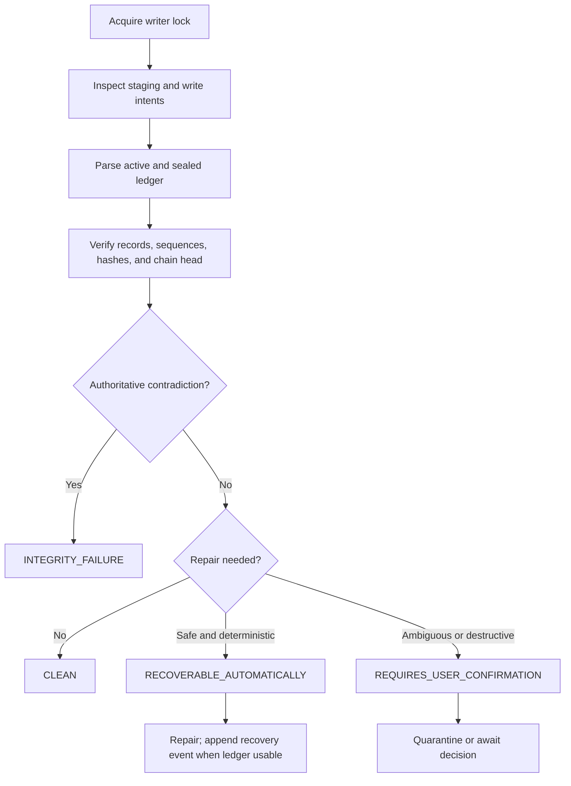
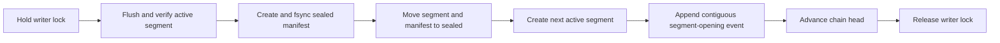
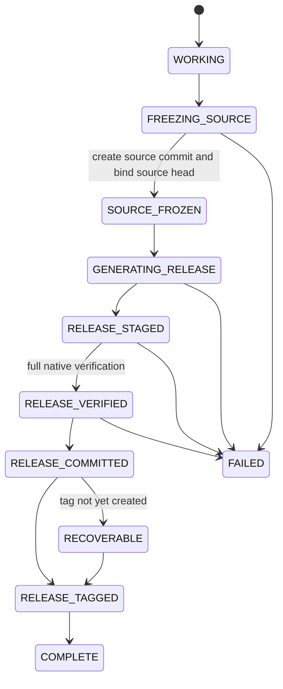
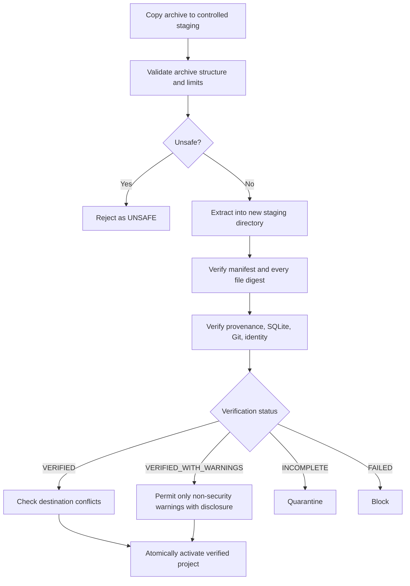
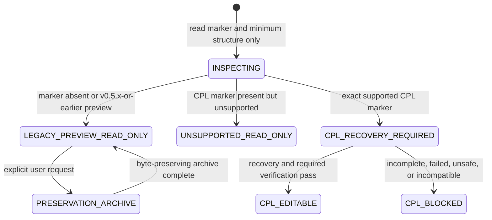

# Thinkloom Provenance State Machines and Recovery Protocols

Status: **Normative Stage 1 companion**

This document defines the required state transitions supporting the [Stage 1 Normative Specification](STAGE-1-NORMATIVE-SPECIFICATION.md). Diagrams are explanatory; the accompanying transition rules are authoritative.

## 1. Cross-store provenance write

```mermaid
stateDiagram-v2
    [*] --> PREPARED: create SQLite write intent
    PREPARED --> RECORDS_DURABLE: stage, fsync, and move immutable records
    RECORDS_DURABLE --> LEDGER_APPENDED: assign sequence; append and fsync event
    LEDGER_APPENDED --> CHAIN_HEAD_ADVANCED: atomically replace chain head
    CHAIN_HEAD_ADVANCED --> SQLITE_APPLIED: apply operational domain state
    SQLITE_APPLIED --> COMPLETE: persist idempotent result
    PREPARED --> FAILED: validation or staging failure
    RECORDS_DURABLE --> QUARANTINED: operation cannot be completed safely
    FAILED --> [*]
    QUARANTINED --> [*]
    COMPLETE --> [*]
```



### 1.1 Binding write procedure

1. Acquire the exclusive OS-managed project writer lock.
2. Resolve `client_action_id`. If a committed ledger event already contains it, rebuild or return the original result.
3. Validate project identity, policy, schema, paths, references, and command payload.
4. Reserve record, event, intent, and revision IDs. Do not reserve `event_sequence`.
5. Create the `PREPARED` SQLite write intent using durable SQLite settings.
6. Write authoritative immutable records to a transaction staging directory located on the same filesystem as the project.
7. Canonicalize, hash, flush, and fsync each staged record.
8. Atomically move records to final locations and flush affected parent directories where the platform permits.
9. Mark the intent `RECORDS_DURABLE`.
10. Derive the next contiguous event sequence from the verified ledger head.
11. Construct the canonical event, including `client_action_id`, references, record digests, and the previous event digest.
12. Append the complete event plus LF to the active ledger segment and fsync it.
13. Mark `LEDGER_APPENDED`.
14. Atomically replace `chain-head.json`, flush its directory where supported, and mark `CHAIN_HEAD_ADVANCED`.
15. Apply operational SQLite domain state and rebuildable query/idempotency indexes.
16. Mark `SQLITE_APPLIED`, store the typed result, and mark `COMPLETE` in one SQLite transaction where practical.
17. Queue derived-index and Git work outside the critical write.
18. Release the project writer lock.

Failures updating a non-authoritative SQLite phase after a durable ledger append MUST NOT invalidate the event. Recovery discovers the event through `client_action_id` and replays it into SQLite.

### 1.2 Idempotency

Every authoritative event MUST contain `client_action_id`. SQLite MAY accelerate lookups, but retry handling MUST remain possible by scanning or indexing the ledger.

The same `client_action_id` with a materially different canonical command digest is an integrity or client-contract error; it MUST NOT be treated as an ordinary retry.

## 2. Startup recovery

For a project already classified as CPL-conforming under §11, recovery begins before it becomes editable. Recovery obtains the project writer lock and classifies the project:

```text
CLEAN
RECOVERABLE_AUTOMATICALLY
REQUIRES_USER_CONFIRMATION
INTEGRITY_FAILURE
```



### 2.1 Recovery matrix

| Observed durable state | Classification | Required action |
|---|---|---|
| SQLite intent only; no durable record | Automatic | Remove or retry the abandoned intent. |
| Complete staged files not moved | Automatic | Resume validated same-filesystem move or quarantine. |
| Final immutable records; no ledger event | Automatic or confirmation | Complete only when intent/record metadata determines the exact event; otherwise quarantine. |
| Complete ledger event; chain head behind | Automatic | Verify the event and referenced records, then advance the chain head. |
| Partial final line not referenced by chain head | Automatic | Remove only the incomplete suffix and record recovery after the ledger is usable. |
| Ledger and chain head valid; SQLite behind | Automatic | Replay events into SQLite and rebuild indexes. |
| SQLite ahead of ledger | Automatic | Roll back/rebuild SQLite from authoritative records. |
| Chain head ahead of readable ledger | Failure or confirmation | Do not invent an event; inspect staging and quarantine until resolved. |
| Event references a missing or modified authoritative record | Integrity failure | Block ordinary editing and release. |
| Sealed segment modified or truncated | Integrity failure | Never alter it automatically. |
| Duplicate `client_action_id` with identical command/result | Automatic | Collapse operational duplicates to the committed event. |
| Duplicate `client_action_id` with conflicting command | Integrity failure | Block the conflicting retry. |
| Stale derived index | Automatic warning | Rebuild without changing provenance. |
| Unacknowledged Git source commit | Automatic or warning | Finish checkpoint acknowledgment if the captured tree verifies; otherwise leave hidden. |
| Partial release state | State dependent | Resume or roll back using the release state machine. |

Orphans MUST be moved to `.app/recovery/orphans/` rather than deleted when their role is uncertain. Recovery actions that change authoritative state MUST append a recovery event once a usable ledger is available.

## 3. Model invocation lifecycle

```mermaid
stateDiagram-v2
    [*] --> REQUEST_PREPARED
    REQUEST_PREPARED --> REQUEST_RECORDED: immutable request + requested event
    REQUEST_RECORDED --> MODEL_RUNNING: release writer lock
    MODEL_RUNNING --> RESPONSE_RECEIVED: provider completes
    MODEL_RUNNING --> FAILED: provider error or output limit
    MODEL_RUNNING --> CANCELLED: user/provider cancellation
    MODEL_RUNNING --> ABANDONED: process loss; no resumable provider state
    RESPONSE_RECEIVED --> RESPONSE_RECORDED: reacquire lock; immutable response + event
    RESPONSE_RECORDED --> STAGED_PREVIEW
    STAGED_PREVIEW --> ACCEPTED
    STAGED_PREVIEW --> PARTIALLY_ACCEPTED
    STAGED_PREVIEW --> REJECTED
    STAGED_PREVIEW --> STALE_CONTEXT_CONFIRMATION: source revisions changed
    STALE_CONTEXT_CONFIRMATION --> ACCEPTED: revalidated/rebased/confirmed
    FAILED --> [*]
    CANCELLED --> [*]
    ABANDONED --> [*]
    ACCEPTED --> [*]
    PARTIALLY_ACCEPTED --> [*]
    REJECTED --> [*]
```



### 3.1 Before provider I/O

Under the writer lock, Thinkloom MUST resolve and hash context; snapshot effective model configuration and prompt-template identity; create the immutable invocation request permitted by retention policy; record manuscript, idea, and conversation revision heads; append `MODEL_INVOCATION_REQUESTED`; then release the lock.

### 3.2 Provider I/O

The provider call occurs outside the writer lock. Output streams only to bounded encrypted temporary storage. The app MAY process other commands and model completions concurrently, subject to configured spool limits.

### 3.3 Completion and disposition

Thinkloom reacquires the lock to create an immutable response or failure, append the completion/failure event, and create a staged preview. Acceptance, partial acceptance, rejection, and later user edits are separate provenance commands.

When a source revision changed during provider I/O, insertion MUST NOT proceed silently. The disposition records whether the result was revalidated, rebased, explicitly accepted as stale, or rejected.

## 4. Temporary invocation spool

Operational stream states are:

```text
CREATED → CONNECTING → STREAMING → COMPLETED
                              ├→ FAILED
                              ├→ CANCELLED
                              ├→ ABANDONED
                              └→ RECOVERING
```

Incomplete spool content is not evidence. On completion, the canonical response/failure must become durable before spool-key deletion. On startup, a spool may be recovered for bounded local inspection or explicit preservation, but Thinkloom MUST NOT describe the original provider request as resumed unless the provider supports it.

## 5. Ledger segment rotation



The opening event links to the final event of the prior segment. Segment file numbering and event sequencing are independent: segment numbers are contiguous files; event sequences are contiguous events. A failure before the new opening event is recoverable from the sealed manifest and prior head. Sealed bytes MUST NOT be modified during recovery.

## 6. Git checkpoint lifecycle

```mermaid
sequenceDiagram
    participant P as Provenance writer
    participant S as Frozen snapshot/index
    participant G as Git
    P->>P: Flush meaningful edits; capture H0
    P->>S: Materialize immutable source tree
    P-->>G: Release provenance lock
    G->>G: Create source commit C1 from captured tree
    G-->>P: Return C1 and tree hash
    P->>P: Verify C1; append checkpoint event H1
    P->>S: Capture acknowledgment tree
    P-->>G: Release provenance lock
    G->>G: Create audit commit C2 from captured tree
```

The source and acknowledgment commits MUST be created from frozen captured trees or isolated Git indexes, not the changing live worktree. `C1` is the restore content. `C2` contains the acknowledgment and may be the visible checkpoint ref. If acknowledgment fails, `C1` remains hidden and recoverable.

## 7. Release finalization



Each state transition MUST be durably recoverable and idempotent. The source commit binds the frozen canonical project and source chain head. The manifest binds the source commit but not the later release commit. The release commit contains the verified release package and manifest; the tag points to it.

A release is not `COMPLETE` until the tag and manifest bindings verify. Failure MUST NOT leave a partial directory or archive that appears complete.

## 8. Backup import



Extraction MUST NOT target an active project directory. Activation MUST remain on the same filesystem or use a verified copy-and-swap protocol with equivalent crash recovery.

## 9. Retention and encryption policy changes

Policy changes are append-only provenance operations:

```text
minimal → full_private: future full records only
full_private → minimal: future minimization only; existing full records remain
none → protected: allowed only after recovery-key verification and protected rewrite protocol
protected → none: explicit confirmed decrypt/rewrite operation
full export ↔ sanitized export: export preference only; no project mutation
```

Content already discarded under minimal retention cannot be recreated. Content already committed under full retention remains until emergency purge.

## 10. Emergency purge

Emergency purge is not ordinary recovery. It requires a separate confirmed state machine that freezes the source, identifies every affected record/reference/index/Git object/export, creates a purge manifest, rewrites retained evidence and Git history, establishes a new chain root, verifies the result, and records the superseded root when safe.

The UI MUST disclose that earlier copies, backups, releases, and exports cannot be revoked.

## 11. Project-format and CPL-conformance classification

Project classification MUST complete without modifying the selected directory and before startup recovery, verification, or any other provenance command.



`LEGACY_PREVIEW_READ_ONLY` permits only explanation, Show Project Folder, and a byte-preserving preservation archive. It MUST NOT invoke CPL recovery, synthesize records, generate HARP, or write a marker. A `schemaVersion: 1.0` field is not a CPL marker. Only the exact supported marker in Specification §23 can enter `CPL_RECOVERY_REQUIRED`, and the marker alone never establishes conformance.

## 12. Deposit and HARP lifecycle

HARP applicability, HARP integrity verification, CPL verification, evidence-boundary status, policy-profile currency, and user approval are independent state dimensions.

```mermaid
stateDiagram-v2
    [*] --> WORKING
    WORKING --> DEPOSIT_FROZEN: select exact file; bind digest and manuscript revision
    DEPOSIT_FROZEN --> EVIDENCE_PROJECTED: deterministic contribution map
    EVIDENCE_PROJECTED --> USER_REVIEW: show facts, declarations, boundaries, and suggestions
    USER_REVIEW --> LANGUAGE_APPROVED: user edits or accepts exact suggested strings
    LANGUAGE_APPROVED --> GENERATED: generate immutable HARP and manifest
    GENERATED --> CURRENT: native integrity verification succeeds
    DEPOSIT_FROZEN --> STALE: manuscript edit or restore
    EVIDENCE_PROJECTED --> STALE: manuscript edit, restore, or dependency change
    USER_REVIEW --> STALE: manuscript edit, restore, or dependency change
    LANGUAGE_APPROVED --> STALE: manuscript edit, restore, or dependency change
    GENERATED --> STALE: current work or bound dependency changes
    CURRENT --> STALE: current work or bound dependency changes
    STALE --> DEPOSIT_FROZEN: select and freeze a new exact deposit
```



### 12.1 Deposit freeze

Under the writer lock, Thinkloom MUST validate that the project is CPL-conforming, finish meaningful edit transactions, select the exact deposit file, compute its digest and byte length, and bind the manuscript revision, CPL chain head and sequence, and layout profile. It then records the immutable deposit snapshot and CPL event. Page, chapter, paragraph, and line locators are derived; stable expression-segment IDs, revision IDs, and digests remain authoritative.

### 12.2 Projection and review

Projection and report rendering occur outside the writer lock from frozen canonical inputs. Before generation, the user MUST be shown unattested, unknown, degraded, stale, and unverified boundaries; self-declared identity status; recorded AI-system disclosures; the policy-profile version; and editable suggested registration language. Selection/arrangement overlays MUST remain separate from recorded origin.

The transition to `LANGUAGE_APPROVED` requires an explicit user action that binds the exact `Author Created`, `Material Excluded`, `New Material Included`, and optional `Note to CO` strings. Merely opening, previewing, or exporting a draft does not approve them.

### 12.3 Generation, verification, and staleness

Under the writer lock, Thinkloom revalidates every frozen dependency and the approval digest before recording the immutable HARP, manifest, and generation event. Native verification then checks the HARP artifact bindings and source CPL scope. Success produces `CURRENT` and the label **HARP integrity verified**, never **authorship verified**.

Any later manuscript edit or restoration makes the HARP stale for the current work, even when the exact historical deposit and HARP remain byte-valid. A changed deposit, assertion, evaluation dependency, sanitization profile, or other bound input also makes the affected HARP stale. Publishing a new policy profile does not rewrite an existing HARP; its separately reported policy status becomes `superseded`. Regeneration always starts from a new immutable deposit snapshot and never mutates the prior HARP.
